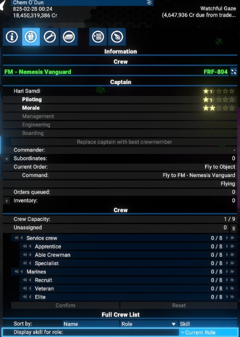

# Lost Ships Replacement - Phantom Crew Revealer

In X4: Foundations, the `Lost Ships Replacement` feature was introduced in version `7.50`.
This feature allows the fleet to request a replacement ship if a ship is lost during the execution of an order. The replacement ship will be requested automatically, and the fleet will continue to execute the order.
However, when you enable the `Lost Ships Replacement` feature for a fleet, the replacement ship will come with only a pilot in place.

At least, only the pilot will be visible in the ship crew information tab.

In reality, there are other crew members on the ship. This extension fixes this issue and reveals these "phantom" crew members on the ship.

## Compatibility

This extension is compatible with the following versions:

- X4: Foundations version `7.50`

## Limitations

This mod "reveals" only `Service crew` and `Marines` on the ship. It does not assign anybody to "officer" posts. Tested on 'S' and 'M' ships.

This mod **only "reveals"** the crew members on the ship, i.e. sets the roles for the crew members. **It does not create/modify any crew members.**

## Download

You can download the latest version via - [Steam client](https://steamcommunity.com/id/chemodun/myworkshopfiles/?appid=392160)
Or you can do it via [Nexus Mods](https://next.nexusmods.com/profile/ChemODun/mods?gameId=2659)

## Usage

Simply install the extension and play as usual.

## Links

A short explanation video on YouTube - [X4 Foundations: Lost Ship Replacement - Phantom Crew Revealer](https://www.youtube.com/watch?v=WM6ZbeVTh6E)

There is a thread on the EGOSOFT forum - [[Mod/AIScript] Lost Ship Replacement - Phantom Crew Revealer](https://forum.egosoft.com/viewtopic.php?t=470128)
